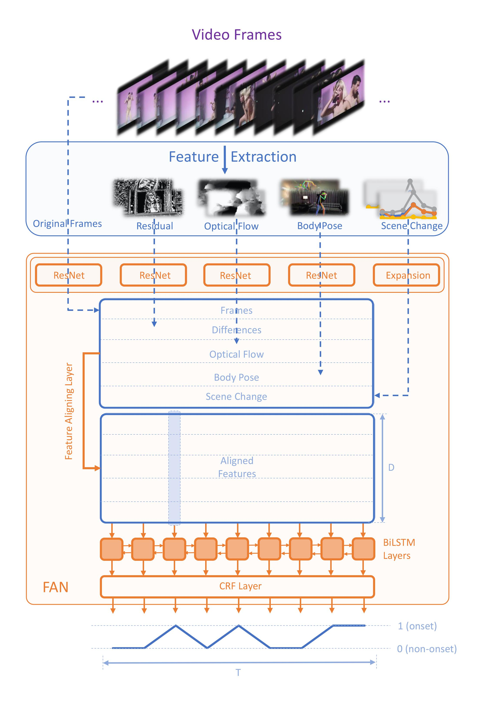

## Abstract

    

In this project, we propose a data-driven visual rhythm prediction method, which overcomes the previous works' deficiency that predictions are made primarily by human-crafted hard rules. In our approach, we first extract features including original frames and their residuals, optical flow, scene change, and body pose. These visual features will be next taken into an end-to-end neural network as inputs.  Here we observe that there are some slight misaligning between features over the timeline and assume that this is due to the distinctions between how different features are computed. To solve this problem, the extracted features are aligned by an elaborately designed layer, which can also be applied to other models suffering from mismatched features, and boost performance. Then these aligned features are fed into sequence labeling layers implemented with BiLSTM and CRF to predict the onsets. Due to the lack of existing public training and evaluation set, we experiment on a dataset constructed by ourselves based on professionally edited Music Videos (MVs), and the F1 score of our approach reaches 79.6.

 

<!--
<table style="width:100% bgcolor:#FFFFFF" align="center">
  <tr>
    <th></th>
    <th></th> 
  </tr>
</table>
-->
<!--

-->
<!--

-->
## Authors

<table style="width:100% bgcolor:#FFFFFF" align="center">
  <tr>
    <th></th>
    <th></th> 
    <th></th>
    <th></th>
  </tr>
  <tr align="center">
    <th>Yutong Xie</th>
    <th>Haiyang Wang</th>
    <th>Yan Hao</th>
    <th>Zihao Xu</th>
  </tr>
</table>

## Demo
<!--

-->

## Code
<!--

We provide source code on [Github](https://github.com/zhiyong1997/Semantic-Alignment-for-Hierarchical-Image-Captioning), including:

<table>
  <tr>
    <td> 1. Train/Test code.</td>
  </tr>
  <tr>
    <td> 2. Visualization tool for attention mechanism.</td>
  </tr>
</table>

-->

### Sample Usage
<!--

Our model can handle COCO, Flickr8k and Flickr30k dataset. For simplicity, we only present Flickr8k here. 

 1. Create folder ./code/dataset 

 2. Download processed Flickr8k Image Captioning Dataset from [here](https://pan.baidu.com/s/1bpSDwJl) with key: sh4u 

 3. Unzip the downloaded file in ./code/dataset/ 

 4. Download resnet50 model file in ./code/saved_model/ from [here](https://pan.baidu.com/s/1nwYEQAP) with key: h712

 4. Run ./code/main.py with python3 

-->

## Paper
 Our paper is available [here](https://github.com/shsjxzh/Visual-Rhythm-Prediction-with-Feature-Aligning-Network/blob/gh-pages/doc/FAN.pdf)

## Bibtex
<pre style="font-size: 1.5em;">
@article{Xie2019VisualRhythm,
          title={Visual Rhythm Prediction with Feature Aligning Network},
          author={Xie, Yutong and Wang, haiyang and Hao, Yan and Xu, Zihao},
          year={2019},
          howpublished={\url{https://github.com/shsjxzh/Visual-Rhythm-Prediction-with-Feature-Aligning-Network}}
        }
</pre>

## Example Result
<!--

-->
